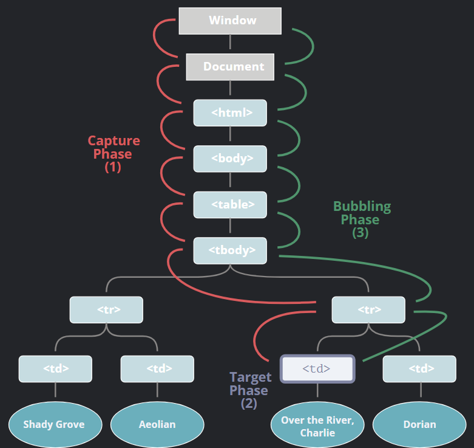

# **Captura y Propagacion de eventos**

**Significado**
* La captura de eventos y el burbujeo de eventos son dos procesos opuestos. Puede haber una analogía muy apropiada. Cuando rompes un objeto que puede flotar en el agua y lo arrojas al agua, primero tendrá un proceso descendente. Este proceso puede entenderse como el proceso de capturar el elemento específico (punto objetivo) desde el nivel superior hasta el evento; luego, debido a que la flotabilidad es mayor que la gravedad del objeto en sí, el objeto flotará en el agua después de alcanzar el punto más bajo (elemento específico) Este proceso Comparado con la captura de eventos, es un proceso retrospectivo, es decir, burbujeo de eventos.

**Captura**

Las aplicaciones JavaScript manejan los eventos que el usuario va provocando.  Dada uno de estos eventos, genera la creación de un objeto de tipo event que posee algunas características propias como el tipo de evento del que se trata o la localización del sitio donde ocurrió el evento.  Normalmente el objeto que genera el event oes el encargado de manejarlo.

**Propagacion**

* El estándar de eventos del DOM describe 3 fases de la propagación de eventos:

1. Fase de captura – el evento desciende al elemento.
2. Fase de objetivo – el evento alcanza al elemento.
3. Fase de propagación – el evento se propaga hacia arriba del elemento.
   
Cuando un evento ocurre en un elemento, este primero ejecuta los manejadores que tiene asignados, luego los manejadores de su padre, y así hasta otros ancestros.
Una de las intenciones de JavaScript con la creación del patrón de propagación de eventos era facilitar la captura de eventos de una fuente, el elemento padre, en lugar de configurar un controlador de eventos en cada elemento secundario interno.

**Luis Otoniel Soto Maldonado 19100799**
